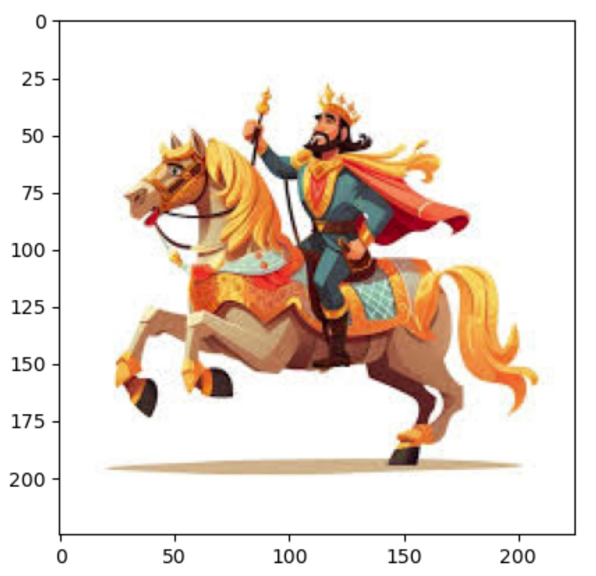
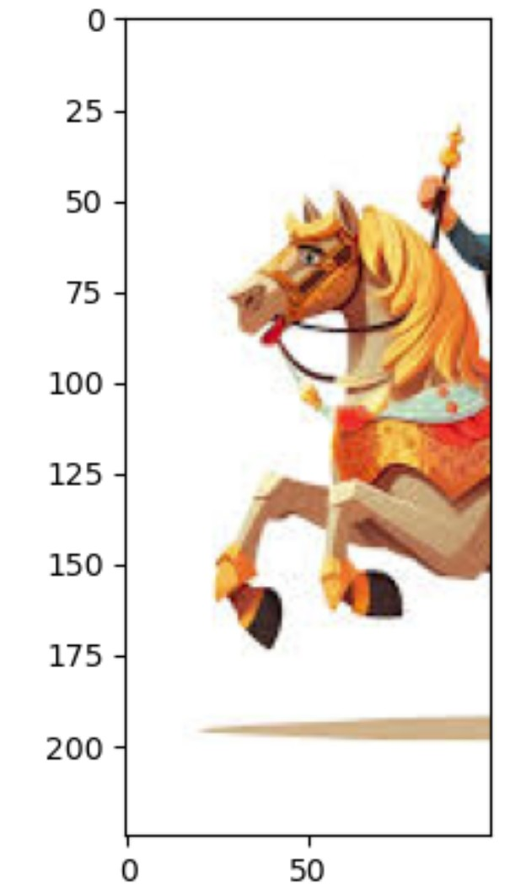
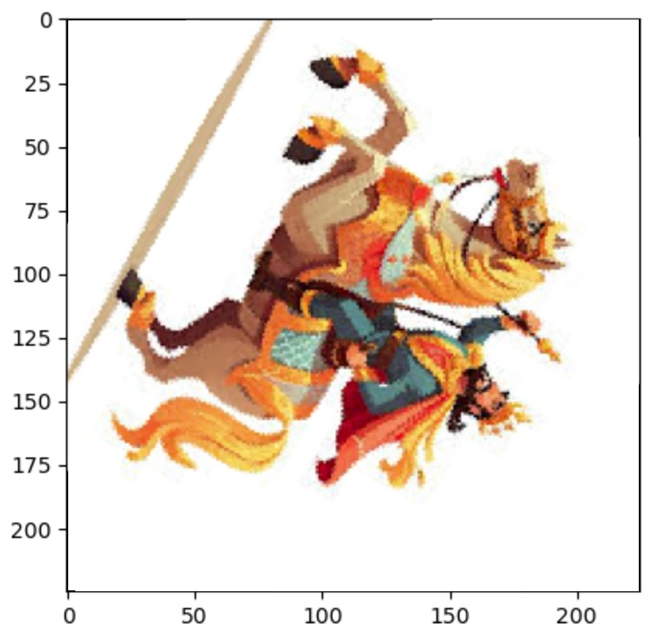

# Bonus

## Loading image

```python
from skimage import io

photo = io.imread('cavalery.jpg')

print(type(photo))
print(photo.shape)
print(photo[125,100])

import matplotlib.pyplot as plt
plt.imshow(photo)
```

<class 'numpy.ndarray'>
(225, 225, 3)
[154  73  44]



## Crop image

```python
from skimage import io
photo = io.imread('cavalery.jpg')
plt.imshow(photo[:, 0:100, :])
```



## Rotate image

```python
from skimage import io
from PIL import Image

photo = io.imread('cavalery.jpg')
photo_pil = Image.fromarray(photo)
photo = photo_pil.rotate(240)

import matplotlib.pyplot as plt
plt.imshow(photo)
```

