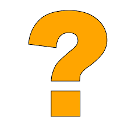

# NumPy Practice Questions

Solve 1 question from each topic:

## Basics

1. Create a NumPy array from the list `[10, 20, 30, 40]`.
2. Reshape the array `np.array([2, 4, 6, 8, 10, 12, 14, 16])` into:

   * Shape `(4, 2)`
   * Shape `(2, 4)`
3. Given `a = np.array([[6, 7, 8, 9], [7, 8, 9, 10]])`, print:

   * `a.shape`
   * `len(a)`
   * `a.ndim`
   * `a.size`
   * `a.dtype`

## Creating Arrays

4. Create a 2×6 array filled with zeros
5. Create a 3×3 array filled with ones
6. Create a 5×2 array with random floats between 0 and 1
7. Create a 4×4 array with random integers between 50 and 150
8. Using `np.random.seed(7)`, generate a 2×5 array of random integers between 5 and 20
9. Reshape the array from question 8 into shape `(5, 2)`
10. Create a 1D array of numbers from 5 to 25 with step size 5
11. Create an array of 6 equally spaced numbers between -1 and 1

## Array Operations

12. Given `a = np.array([2, 4, 6])` and `b = np.array([1, 3, 5])`, compute:

* `a + b`
* `a - b`
* `a * b`
* `a / b`
* `a ** 3`

13. Given `a = np.array([2, 4, 6, 100])`, compute the mean

## Array Manipulation

14. From the array `B = np.array([[2, 4, 6], [8, 10, 12], [14, 16, 18]])`, extract:

* The element at row 2, column 1
* All elements from column 0
* All elements from row 2

15. *Bonus: Sort the array `np.array([12, 4, 9, 1])`
16. *Bonus: Sort the array `S = np.array([[9, 7, 8], [3, 2, 1]])` by rows and by columns

## Random Numbers & Filtering

17. Generate a 3×4 array of random integers between 0 and 50 with `np.random.seed(11)`
18. From `a = np.array([5, 15, 25, 35, 45])`, extract all values greater than the mean
19. Given `a = np.array([2, 4, 6, 8, 10, 12])`, extract:

* Elements greater than 5 and divisible by 4
* Elements less than 5 or greater than 9
* Elements not greater than 7

20. Given `a = np.array([42, 7, 19, 88])`, find:

* The index of the minimum element
* The index of the maximum element

21. *Bonus: From the array `B = np.array([[12, 45, 7], [33, 5, 29]])`, find the indices of the minimum and maximum elements in 1D form + 2D form

## Images

22. *Bonus: use the image from ```images/numpy1.png``` -- load it and rotate it 90 degrees

**Submission email**: [pythonai200425+numpysum@gmail.com](mailto:pythonai200425+numpysum@gmail.com)

