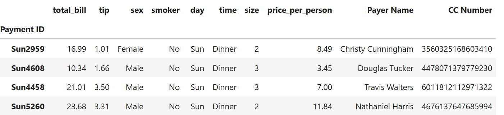

# Pandas – Grouping, Aggregation & Advanced Tricks 🐼🔎

In this lesson, we’ll explore powerful Pandas features for grouping, aggregation, sorting, and analyzing data. Each topic is explained with code and output, following the style of the tricks lesson



## 1. Sorting DataFrames 📊

You can sort DataFrames by one or more columns, ascending or descending

```python
import pandas as pd
df = pd.read_csv("tips.csv")
df = df.set_index('Payment ID')
df['CC Number'] = df['CC Number'].astype(str)

# Sort by total_bill ascending
print(df.sort_values(by='total_bill'))

# Sort by total_bill descending
print(df.sort_values(by='total_bill', ascending=False))

# Top 5 biggest bills
print(df.sort_values(by='total_bill', ascending=False).head(5))

# Bottom 5 smallest bills
print(df.sort_values(by='total_bill', ascending=False).tail(5))

# Sort by multiple columns
print(df.sort_values(by=['day', 'smoker', 'price_per_person']).head(10))

# Custom sort order for multiple columns
print(df.sort_values(by=['day', 'smoker', 'price_per_person'], ascending=[True, False, False]).head(10))
```

## 2. Finding Specific Rows 🔍

You can use sorting to find rows with max/min values for specific groups

```python
# Find the male who paid the max total_bill
print(df.sort_values(by=['sex', 'total_bill'], ascending=[False, False]).head(1))

# Find the female who paid the lowest total_bill
print(df.sort_values(by=['sex', 'total_bill'], ascending=[True, True]).head(1))

# Find the day and time of the highest total_bill
print(df.sort_values(by=['total_bill'], ascending=True).head(1)[['total_bill', 'day', 'time']])

# Find the CC number used for highest size and tip
print(df.sort_values(by=['size', 'tip'], ascending=[False, False]).head(1)[['size', 'tip', 'CC Number']])
```

## 3. Counting & Value Counts 📋

Count occurrences of values in columns or combinations of columns

```python
# Count by gender
print(df['sex'].value_counts())

sex
Male      157
Female     87
Name: count, dtype: int64


# Count by day and gender
print(df[['day', 'sex']].value_counts(ascending=True).to_frame())

day  sex          
Fri  Female      9
     Male       10
Sun  Female     18
Sat  Female     28
Thur Male       30
     Female     32
Sun  Male       58
Sat  Male       59

# Count smokers by day and gender
print(df[df['smoker'] == 'Yes'][['smoker','day', 'sex']].value_counts())

smoker  day   sex   
Yes     Sat   Male      27
              Female    15
        Sun   Male      15
        Thur  Male      10
        Fri   Male       8
              Female     7
        Thur  Female     7
        Sun   Female     4
Name: count, dtype: int64
```

## 4. GroupBy & Aggregation 🧮

Group data by one or more columns and calculate statistics

```python
# Group by gender and count
print(df.groupby(by='sex').size())

sex
Female     87
Male      157
dtype: int64

# Group by gender and calculate mean of numeric columns
print(df.groupby(by='sex').mean(numeric_only=True))

        total_bill       tip      size  price_per_person   
sex                                                                   
Female   18.056897  2.833448  2.459770          7.464368  
Male     20.744076  3.089618  2.630573          8.123057  

# Group by day and mean
print(df.groupby(by='day').mean(numeric_only=True))

      total_bill       tip      size  price_per_person     
day                                                                 
Fri    17.151579  2.734737  2.105263          8.133158  
Sat    20.441379  2.993103  2.517241          8.186782  
Sun    21.410000  3.255132  2.842105          7.863684 
Thur   17.682742  2.771452  2.451613          7.424194  

# Group by day and gender, max/min tip
print(df.groupby(by=['day', 'sex'])[['tip']].max(numeric_only=True))
print(df.groupby(by=['day', 'sex'])[['tip']].min(numeric_only=True))
print(df.groupby(by=['day', 'sex'])[['tip']].std(numeric_only=True))

# Get std for Saturday males
print(df.groupby(by=['day', 'sex'])[['tip']].std(numeric_only=True).loc['Sat', 'Male'].to_frame())

# Count by time and gender
print(df.groupby(by=['time', 'sex']).size())

# Count by day
print(df.groupby(by=['day']).size())

# Max price per person per day/gender
print(df.groupby(by=['day', 'sex'])['price_per_person'].max())

# Min price per person per day/size
print(df.groupby(by=['day', 'size'])['price_per_person'].min())

# Sum of total bill per size and smoker
print(df.groupby(by=['size', 'smoker'])['total_bill'].sum())

size  smoker
1     No          17.32
      Yes         11.65
2     No        1380.81
      Yes       1185.08
3     No         546.25
      Yes        338.30
4     No         722.00
      Yes        336.70
5     No          91.73
      Yes         58.61
6     No         139.32

# Sum for size 2 smokers
print(df.groupby(by=['size', 'smoker'])['total_bill'].sum().loc[2, 'Yes'])

1185.08

# Max price per person for Sunday males
print(df.groupby(by=['day', 'sex'])['price_per_person'].max())

day   sex   
Fri   Female    11.38
      Male      14.48
Sat   Female    14.77
      Male      16.94
Sun   Female     8.82
      Male      20.27
Thur  Female    10.78
      Male      16.34

print(df.groupby(by=['day', 'sex'])['price_per_person'].max().loc[:, 'Male'])

day
Fri     14.48
Sat     16.94
Sun     20.27
Thur    16.34

```

## 5. Shortcuts & Advanced Tricks ⚡

Useful Pandas shortcuts for quick analysis

```python
# Top/bottom n by column
print(df.sort_values(by='tip', ascending=False).head(10))
print(df.nlargest(10, 'tip'))
print(df.nsmallest(10, 'tip'))

# Sample rows
print(df.sample(5))
print(df.sample(int(df.shape[0] / 10)))
print(df.sample(frac=0.1))

# Aggregate functions
print(df['price_per_person'].max())
print(df['price_per_person'].min())
print(df.agg({'price_per_person': ['max', 'min', 'mean'], 'tip': ['std', 'mean']}).transpose())

# Get all categories of a column
print(list(df['day'].value_counts().reset_index()['day']))
print(list(df['time'].value_counts().reset_index()['time']))
print(list(df['day'].unique()))
print(df['day'].nunique())

# String operations
print(df['Payer Name'].apply(lambda name: str.lower(name)))
print(df['Payer Name'].str.lower().str.capitalize().str.replace(' ', '-'))
```

