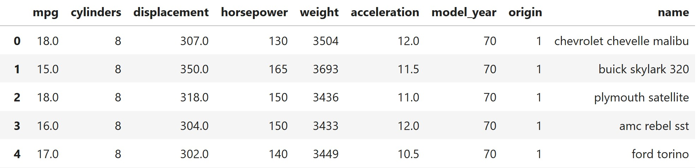

# Pandas – Exercises 🎯

Practice your new skills with these exercises. Try to solve them without looking back, and only peek if you get stuck 😉



## 1. load the dataframe from csv/mpg.csv

<a href="csv/mpg.csv">link to csv file</a>

```python
df = pd.read_csv("mpg.csv")
```
## 1. Sorting 🔢

Q1.1 Sort the DataFrame by mpg in ascending order  
Q1.2 Sort the DataFrame by weight in descending order  
Q1.3 Sort by model_year first, then by mpg within each year  

## 2. Value Counts 📊

Q2.1 Find how many cars of each cylinders type exist  
Q2.2 Count how many times each origin appears  
Q2.3 Which model_year has the most cars?  

## 3. GroupBy & Aggregations 🧮

Q3.1 Group by cylinders and calculate the average mpg  
Q3.2 Group by origin and find the maximum horsepower  
Q3.3 Group by model_year and calculate both the mean and median of weight  

## 4. Unique & nunique 🎯

Q4.1 How many unique car names are in the dataset?  
Q4.2 List all unique values in the cylinders column  
Q4.3 How many unique model_year values are there?  

**Submission email**: [pythonai200425+pandashw3@gmail.com](mailto:pythonai200425+pandashw3@gmail.com)