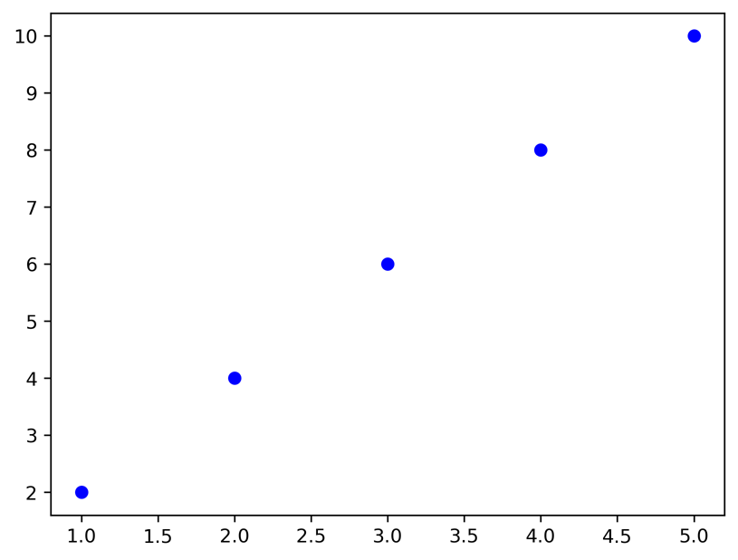

## What is Matplotlib?

**Matplotlib** is a Python library for creating static, animated, and interactive visualizations.
It is widely used for data analysis, visualization, and presentations.

The most common module is **pyplot**, often imported as `plt`.

```python
import matplotlib.pyplot as plt
```

## Creating Simple Graphs

```python
import matplotlib.pyplot as plt

x = [1, 2, 3, 4, 5]
y = [2, 4, 6, 8, 10]

plt.plot(x, y)
plt.show()
```


You can add features:

```python
plt.plot(x, y)
plt.grid(True)
plt.legend(["Line"])
plt.xlim(0, 6)
plt.ylim(0, 12)

# Save the figure before showing it
plt.savefig("example_plot.png", dpi=300, bbox_inches='tight')

plt.show()
```


**Explanation**

* `plt.plot(x, y)` → draws a line connecting the (x, y) points
* `plt.grid(True)` → displays grid lines on the chart for easier reading
* `plt.legend(["Line"])` → adds a legend with the label "Line" (useful when multiple lines are plotted)
* `plt.xlim(0, 6)` → sets the x-axis limits between 0 and 6
* `plt.ylim(0, 12)` → sets the y-axis limits between 0 and 12
* `plt.show()` → displays the plot window

## Creating Multiple Graphs

### Using `figure` and `add_axes`

```python
fig = plt.figure()
ax1 = fig.add_axes([0,0,1,1])
ax2 = fig.add_axes([0.2,0.5,0.4,0.3])

ax1.plot(x, y)
ax2.plot(y, x)
plt.show()
```


**Explanation**

* `fig = plt.figure()` → creates a new, empty figure canvas to draw on
* `fig.add_axes([left, bottom, width, height])` → adds an axes (plot area) to the figure using **normalized figure coordinates** (0–1). Here `ax1` fills the whole figure, and `ax2` is a smaller axes placed at `(0.2, 0.5)` with size `(0.4, 0.3)`
* `ax1.plot(...)` / `ax2.plot(...)` → each axes draws independently; you control titles, labels, limits, etc., per-axes (e.g., `ax2.set_title("Inset")`)
* `plt.show()` → renders the figure with both axes visible

> Tip: `add_axes` gives full manual control over placement. If you want evenly spaced grids, prefer `plt.subplots(...)`

### Using `subplots`

```python
fig, axes = plt.subplots(1, 2)

axes[0].plot(x, y)
axes[1].plot(y, x)

plt.show()
```


**Explanation**

* `plt.subplots(rows, cols)` creates a **grid (table) of axes** with the given number of rows and columns
* When rows or cols > 1, `axes` is a NumPy array of Axes objects. Index as `axes[row, col]` (or `axes[i]` for a 1D case)
* In the example above we created **1 row × 2 columns**, so `axes` is 1D with length 2: `axes[0]`, `axes[1]`

### 2×2 structure (rows=2, cols=2)

```python
fig, axes = plt.subplots(2, 2, figsize=(8, 6))  # 2 rows × 2 cols

# Top-left (row 0, col 0)
axes[0, 0].plot(x, y)
axes[0, 0].set_title("Top-Left")

# Top-right (row 0, col 1)
axes[0, 1].plot(y, x)
axes[0, 1].set_title("Top-Right")

# Bottom-left (row 1, col 0)
axes[1, 0].scatter(x, y)
axes[1, 0].set_title("Bottom-Left")

# Bottom-right (row 1, col 1)
axes[1, 1].hist([1,2,2,3,3,3,4,5], bins=5)
axes[1, 1].set_title("Bottom-Right")

# Global adjustments
fig.suptitle("2×2 Subplots Grid")
plt.tight_layout()
plt.show()
```


**Notes**

* Use `figsize=(w, h)` to control figure size
* `fig.suptitle` adds a title for the whole grid (the figure)
* `plt.tight_layout()` improves spacing between subplots

## Customizing the Graph

```python
# Data
x = np.linspace(0, 10, 100)
y = np.sin(x)
y2 = np.cos(x)

# Create the figure and axis
fig, graph = plt.subplots(figsize=(8, 6))

# Plot with all the mentioned features
# First line: customized color, line width (lw), line style (ls), marker, and marker size
graph.plot(x, y, label='Sine Wave', color='#15d15a', lw=10, ls='--', marker='o', markersize=8)

# Second line: another set of customization
graph.plot(x, y2, label='Cosine Wave', color='red', lw=3, linestyle='-', marker='x', markersize=8)

# Set title, labels, and legend
graph.set_title('Customized Chart', fontsize=24)
graph.set_xlabel('X-axis', fontsize=12)
graph.set_ylabel('Y-axis', fontsize=12)

# Add legend
graph.legend()

# Add grid
graph.grid(True)

# Show the plot
plt.tight_layout()
plt.show()
```


Parameters:

* **marker** → shape of points (e.g., `o`, `s`, `^`)
* **lw** → line width
* **linestyle** → `-`, `--`, `:`, `-.`

## Drawing Two Graphs in the Same Axis

```python
plt.plot(x, y, label="Line 1")
plt.plot(x, [i**2 for i in x], label="Line 2")
plt.legend()
plt.show()
```


## Scatter Plot

```python
plt.scatter(x, y, color='blue')
plt.show()
```



**Explanation**

* A scatter plot shows individual data points as markers.
* Useful for showing **relationships** or **correlations** between two variables.

## Bar Chart

```python
categories = ['A', 'B', 'C']
values = [5, 7, 3]

plt.bar(categories, values)
plt.show()
```


**Explanation**

* A bar chart compares values across a few **categories**.
* Each bar’s height represents the value for that category.
* Great for **discrete comparisons** (e.g., sales by product).

## Histogram

```python
import numpy as np

data = np.random.randn(1000)

plt.hist(data, bins=30, color='green')
plt.show()
```


**Explanation**

* A histogram shows the **distribution** of continuous data.
* `bins` splits the data range into intervals (like buckets). Here `bins=30` means 30 intervals.
* The height of each bar shows how many values fall into that interval.
