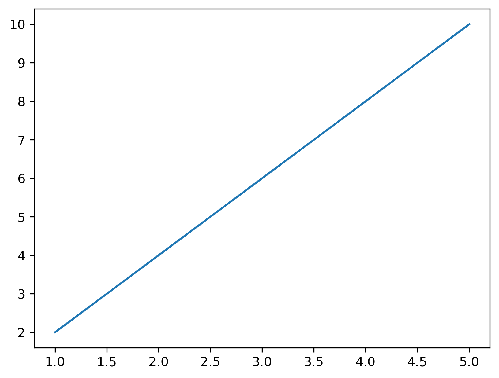
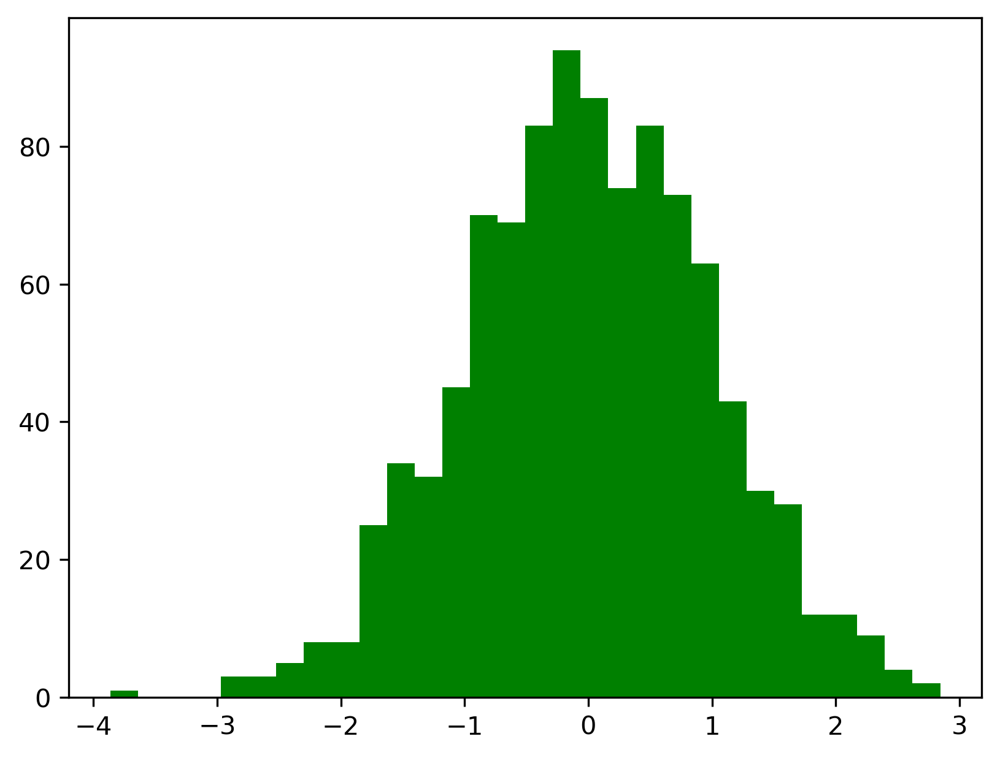

# Matplotlib – Exercises 🎯

Practice your plotting skills with these hands‑on tasks. Stick to **matplotlib** (no seaborn) and save each figure as requested

## 1. Linear Model – Taxi Fare vs Distance 🚕

A city taxi charges a base fare plus a fixed rate per kilometer:

> **fare = 8 + 5 × distance_km**

**Tasks**

1. Create `x = np.arange(0, 11)` to represent 0–10 kilometers
2. Compute `y = 8 + 5 * x` for the taxi fare
3. Plot the line with: title, x/y labels, and legend
4. Limit the axes to `xlim(0, 10)` and `ylim(0, 60)`
5. Save as **taxi_fare_line.jpg** and show the plot

Line graph demo:


## 2. Visual Analysis with `tips.csv` 🍽️

```python
df = pd.read_csv("tips.csv")
```

Link to  <a hef="csv/tips.cvs">tips.csv</a>

### 2.1. Scatter: price_per_person (x) vs tip (y)

* Create a scatter plot of `price_per_person` (x-axis) vs `tip` (y-axis)
* Add title and axis labels
* By looking at the graph- Is there a correlation?

Scatter graph demo:


### 2.2. Bar: maximum total_bill per day

* For each `day`, find the **max total_bill**
* Plot a bar chart of these maxima

Bar graph demo:


### 2.3. Histogram: tips

* Plot a histogram of `tip`
* **Question**: *By looking at the graph- what is the range of the most common tip?*

Histogram graph demo:


### 2.4. Histogram: tip percentage

* Create a new column `tip_perc = 100 * tip / total_bill`
* Plot a histogram of `tip_perc`
* **Question**: *By looking at the graph- what is the range of the most tip percentage?*

Histogram graph demo:


### 2.5. Subplots: combine all four visuals

* Create a **2×2** grid using `fig, axes = plt.subplots(2, 2, figsize=(10, 7))`
* Recreate the four plots in their own axes objects:
  (1) scatter, (2) bar of max per day, (3) tip histogram, (4) tip% histogram
* Make sure each subplot has a title and labeled axes
* Adjust layout and save as **tips_overview.png**

Subplot graph demo:


**Submission email**: [pythonai200425+matplothw1@gmail.com](mailto:pythonai200425+matplothw1@gmail.com)